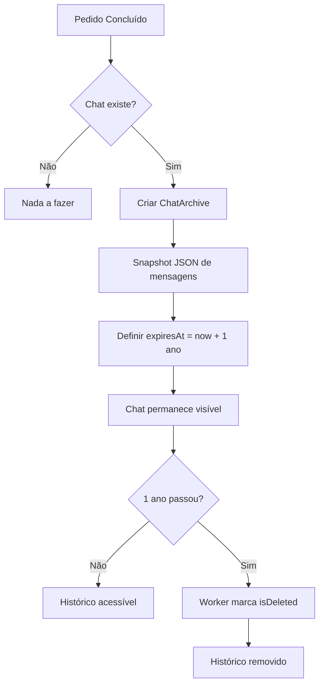

# 📦 Política de Retenção de Chat - Mktplace P2P

**Versão:** 1.0
**Data de Implementação:** 31/10/2025
**Última Atualização:** 31/10/2025

---

## 📋 Sumário Executivo

Este documento descreve a política de retenção e rastreabilidade de mensagens de chat do Mktplace P2P, implementada para garantir conformidade com LGPD e fornecer rastreabilidade completa para auditoria e resolução de disputas.

---

## 🎯 Objetivo

Manter histórico completo de comunicações entre usuários durante transações P2P, preservando evidências para:
- ✅ Resolução de disputas
- ✅ Auditoria de conformidade
- ✅ Investigações de fraude
- ✅ Proteção legal de ambas as partes

---

## ⏰ Período de Retenção

### 📅 **1 Ano Após Conclusão/Cancelamento**

Todas as mensagens de chat são preservadas por **1 ano** a partir da data de:
- Conclusão do pedido (status COMPLETED)
- Cancelamento do pedido (status CANCELLED)
- Expiração do pedido (status EXPIRED)

### 🗑️ **Deleção Automática**

Após 1 ano, as mensagens são **permanentemente deletadas** por um worker automatizado que roda diariamente às 3h da manhã.

---

## 🔐 Acesso ao Histórico

### Quem Pode Acessar?

| Usuário | Acesso | Período |
|---------|--------|---------|
| **Comprador** | Histórico completo | Durante transação + 1 ano |
| **Vendedor** | Histórico completo | Durante transação + 1 ano |
| **Admin/Master** | Todos os históricos | Ilimitado (via banco) |
| **Sistema de Disputas** | Anexado automaticamente | Quando disputa é criada |

### Onde Acessar?

1. **Durante a transação:** Aba "Chat" na página do pedido (`/orders/[orderId]`)
2. **Após conclusão:** Aba "Histórico" na página do pedido
3. **Admin:** Painel administrativo ou direto no banco de dados

---

## 🛠️ Implementação Técnica

### Arquitetura do Sistema

```
Pedido Ativo
    ├─ Chat.messages[] → Mensagens ativas (banco principal)
    └─ Chat.isActive = true

Pedido Concluído/Cancelado
    ├─ Chat.messages[] → Preservadas (NUNCA deletadas)
    ├─ ChatArchive → Snapshot JSON criado
    │   ├─ reason: "ORDER_COMPLETED" | "ORDER_CANCELLED"
    │   ├─ messagesSnapshot: JSON com todas mensagens
    │   ├─ archivedAt: Data do arquivamento
    │   └─ expiresAt: archivedAt + 1 ano
    └─ Chat.isActive = true (histórico visível)

Após 1 Ano
    └─ ChatArchive.isDeleted = true (soft delete)
    └─ Worker pode fazer hard delete depois
```

### Modelo de Dados

```prisma
model ChatArchive {
  id String @id

  originalChatId String
  reason String // ORDER_COMPLETED, ORDER_CANCELLED, ORDER_EXPIRED

  messagesSnapshot String // JSON array
  archivedBy String? // Admin que arquivou (null = automático)

  archivedAt DateTime
  expiresAt DateTime // archivedAt + 1 ano

  isDeleted Boolean @default(false)
  deletedAt DateTime?
}
```

### Worker de Limpeza

**Arquivo:** `apps/api/src/workers/chat-archive.worker.ts`

**Cron:** Diariamente às 3:00 AM
**Ação:** Marca `isDeleted = true` em arquivos com `expiresAt < now()`

---

## 📊 Fluxo de Arquivamento



---

## 🔒 Segurança e Privacidade

### LGPD Compliance

✅ **Minimização de Dados:** Apenas mensagens relacionadas a transações são arquivadas
✅ **Limitação de Retenção:** Deleção automática após 1 ano
✅ **Finalidade Específica:** Disputas, auditoria, segurança
✅ **Acesso Restrito:** Apenas participantes e admins
✅ **Direito ao Esquecimento:** Após 1 ano, dados são deletados

### Criptografia

- ✅ **E2E opcional:** Mensagens podem ser criptografadas end-to-end
- ✅ **Arquivos preservam criptografia:** Snapshots mantêm `encryptedContent` original
- ✅ **Descriptografia no cliente:** Chaves privadas permanecem com usuários

---

## 📝 Logs de Auditoria

Todas as ações críticas são logadas:

| Ação | Log |
|------|-----|
| Chat arquivado | `[CHAT ARCHIVE] Chat archived - chatId, reason, messageCount, expiresAt` |
| Arquivo deletado | `[CHAT ARCHIVE CLEANUP] Expired archives deleted - count, IDs` |
| Acesso ao histórico | Não logado (frequente demais) |

---

## 🚨 Procedimentos de Emergência

### Exportar Histórico Antes da Expiração

Se necessário preservar além de 1 ano (ordem judicial, etc):

```bash
# Conectar ao banco
cd apps/api
npx prisma studio

# Exportar manualmente a tabela ChatArchive
# Ou usar SQL direto:
sqlite3 dev.db "SELECT * FROM ChatArchive WHERE originalChatId = 'CHAT_ID';"
```

### Restaurar Mensagens de Arquivo

Arquivos marcados como `isDeleted = true` podem ser restaurados manualmente:

```sql
UPDATE ChatArchive SET isDeleted = false WHERE id = 'ARCHIVE_ID';
```

---

## 📞 Contato

Para questões sobre política de retenção:
- **Email:** compliance@mktplace.com
- **Documentação Técnica:** `/CHAT_SYSTEM.md`

---

## 🔄 Changelog

| Versão | Data | Mudanças |
|--------|------|----------|
| 1.0 | 31/10/2025 | Política inicial implementada |

---

**Última Revisão:** 31/10/2025
**Próxima Revisão:** 31/10/2026
