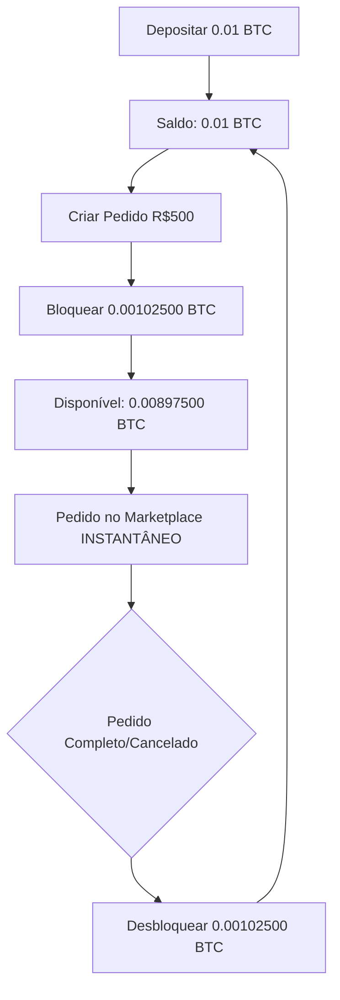

# 💰 Guia do Sistema de Colateral Pré-Depositado (Saldo Interno)

## 📋 Índice
1. [Visão Geral](#visão-geral)
2. [Benefícios](#benefícios)
3. [Como Funciona](#como-funciona)
4. [Fluxos de Uso](#fluxos-de-uso)
5. [API Endpoints](#api-endpoints)
6. [Arquitetura Técnica](#arquitetura-técnica)
7. [Segurança](#segurança)
8. [Troubleshooting](#troubleshooting)

---

## 🎯 Visão Geral

O **Sistema de Colateral Pré-Depositado** permite que usuários mantenham um saldo de criptomoedas na plataforma, eliminando a necessidade de depositar colateral a cada novo pedido.

### Antes vs Depois

**❌ Antes (Sistema Antigo):**
```
Criar Pedido → Gerar QR Code → Depositar Colateral → Aguardar confirmação (10-30 min) → Pedido no marketplace
```
- **Problema:** Taxa de rede em CADA pedido
- **Tempo:** 10-30 minutos por pedido
- **Custo:** ~$5 (R$25) por pedido

**✅ Depois (Sistema Novo):**
```
Depositar 1x → Criar pedidos INSTANTÂNEOS → Saldo desbloqueado automaticamente
```
- **Vantagem:** 1 taxa de rede para N pedidos
- **Tempo:** <1 segundo por pedido
- **Economia:** 90-99% em taxas

---

## 🏆 Benefícios

### Para Usuários
- ✅ **Economia massiva de taxas** (90-99%)
- ✅ **Pedidos instantâneos** (0 segundos vs 10-30 min)
- ✅ **Conveniência** (sem esperar blockchain)
- ✅ **Flexibilidade** (múltiplos pedidos com 1 depósito)
- ✅ **Depósito parcial** (se faltar R$100, deposita só R$100)

### Para Plataforma
- ✅ **Maior retenção de usuários** (saldo depositado "prende" usuário)
- ✅ **Liquidez garantida** (pool de colateral sempre disponível)
- ✅ **Menos chamadas blockchain** (economia de custos de API)
- ✅ **Melhor UX** (usuários mais satisfeitos)

---

## 🔧 Como Funciona

### Conceito de Saldo Interno

Cada usuário tem um **saldo interno** por cripto/rede:

```
Saldo Total = Saldo Disponível + Saldo Bloqueado

Exemplo:
- Total: 0.01 BTC
- Bloqueado: 0.003 BTC (em 3 pedidos ativos)
- Disponível: 0.007 BTC (para novos pedidos)
```

### Fluxo de Bloqueio/Desbloqueio



---

## 📱 Fluxos de Uso

### Fluxo 1: Primeiro Uso (Depósito Inicial)

**Usuário nunca depositou:**

1. Acessa "Meu Saldo de Colateral"
2. Clica "Adicionar Colateral"
3. Escolhe cripto (BTC) e rede (BITCOIN)
4. Informa valor (ex: 0.01 BTC)
5. Recebe QR Code
6. Faz depósito na blockchain
7. Aguarda confirmação (10-30 min)
8. ✅ Saldo creditado!

**Agora pode criar pedidos instantâneos!**

---

### Fluxo 2: Criação de Pedido com Saldo Suficiente

**Usuário tem saldo disponível:**

1. Acessa "Criar Pedido"
2. Preenche formulário (PIX R$500, BTC)
3. Clica "Criar Pedido"
4. Sistema verifica:
   ```
   Saldo Disponível: 0.00800000 BTC
   Necessário: 0.00102500 BTC (R$500 + 2.5%)
   ✅ Tem saldo suficiente!
   ```
5. ✅ **Pedido criado INSTANTANEAMENTE**
6. ✅ **Aparece no marketplace imediatamente**
7. Saldo bloqueado: 0.00102500 BTC

---

### Fluxo 3: Criação de Pedido com Saldo Insuficiente (Depósito Parcial)

**Usuário tem saldo, mas não suficiente:**

1. Acessa "Criar Pedido"
2. Preenche formulário (PIX R$1.000, BTC)
3. Clica "Criar Pedido"
4. Sistema verifica:
   ```
   Saldo Disponível: 0.00150000 BTC
   Necessário: 0.00205000 BTC (R$1000 + 2.5%)
   ❌ Falta: 0.00055000 BTC
   ```
5. Mostra modal:
   ```
   ⚠️ Saldo Insuficiente

   Você tem: 0.00150000 BTC
   Falta: 0.00055000 BTC

   Deposite apenas a diferença:
   [QR Code: 0.00055000 BTC]

   Seu saldo será usado automaticamente!
   ```
6. Usuário deposita apenas 0.00055000 BTC
7. Após confirmação:
   - Soma: 0.00150000 + 0.00055000 = 0.00205000 BTC
   - ✅ Pedido criado automaticamente

---

### Fluxo 4: Liberação Automática de Colateral

**Quando pedido termina:**

```
Pedido COMPLETED/CANCELLED/TIMEOUT/EXPIRED
         ↓
Worker detecta (a cada 1 minuto)
         ↓
Desbloqueia colateral automaticamente
         ↓
Registra em AuditLog
         ↓
✅ Saldo disponível novamente
```

**Usuário recebe notificação:**
```
🔓 Colateral Liberado

Seu saldo de 0.00102500 BTC foi desbloqueado!
Pedido #ABC123 foi concluído.

Disponível agora: 0.00897500 BTC
```

---

## 🔌 API Endpoints

### GET `/api/v1/collateral-balance`
Obter todos os saldos do usuário

**Response:**
```json
{
  "success": true,
  "data": {
    "balances": [
      {
        "id": "clxxx",
        "cryptoType": "BTC",
        "network": "BITCOIN",
        "balance": "0.01000000",
        "lockedAmount": "0.00300000",
        "availableAmount": "0.00700000",
        "totalDeposited": "0.01000000",
        "totalUsed": "0.00500000"
      }
    ]
  }
}
```

---

### GET `/api/v1/collateral-balance/:cryptoType/:network`
Obter saldo específico

**Example:** `GET /api/v1/collateral-balance/BTC/BITCOIN`

**Response:**
```json
{
  "success": true,
  "data": {
    "balance": {
      "cryptoType": "BTC",
      "network": "BITCOIN",
      "balance": "0.01000000",
      "lockedAmount": "0.00300000",
      "availableBalance": "0.00700000"
    }
  }
}
```

---

### GET `/api/v1/collateral-balance/history`
Obter histórico de transações

**Query params:**
- `cryptoType` (opcional): BTC, USDT, USDC
- `network` (opcional): BITCOIN, ETHEREUM, TRC20, etc
- `type` (opcional): DEPOSIT, LOCK, UNLOCK, REFUND, WITHDRAWAL
- `limit` (opcional): padrão 50
- `offset` (opcional): padrão 0

**Response:**
```json
{
  "success": true,
  "data": {
    "transactions": [
      {
        "id": "clxxx",
        "type": "LOCK",
        "amount": "0.00102500",
        "balanceBefore": "0.01000000",
        "balanceAfter": "0.00897500",
        "orderId": "clyyy",
        "description": "Colateral bloqueado para pedido clyyy",
        "createdAt": "2025-10-23T10:00:00.000Z"
      },
      {
        "id": "clzzz",
        "type": "DEPOSIT",
        "amount": "0.01000000",
        "txHash": "0xabc...def",
        "description": "Primeiro depósito de 0.01 BTC",
        "createdAt": "2025-10-23T09:00:00.000Z"
      }
    ]
  }
}
```

---

### GET `/api/v1/collateral-balance/stats`
Obter estatísticas

**Response:**
```json
{
  "success": true,
  "data": {
    "stats": {
      "totalDeposits": 0.01,
      "totalLocks": 0.005,
      "totalUnlocks": 0.002,
      "totalWithdrawals": 0,
      "activeOrders": 3,
      "completedOrders": 2,
      "transactionCount": 7
    }
  }
}
```

---

### POST `/api/v1/collateral-balance/deposit`
Iniciar depósito

**Body:**
```json
{
  "cryptoType": "BTC",
  "network": "BITCOIN",
  "amount": "0.01"
}
```

**Response:**
```json
{
  "success": true,
  "data": {
    "collateralAddress": {
      "id": "clxxx",
      "address": "bc1q...",
      "expectedAmount": "0.01",
      "expiresAt": "2025-10-23T11:00:00.000Z"
    }
  },
  "message": "Endereço de depósito gerado. Envie o pagamento para creditá-lo em seu saldo interno."
}
```

---

### GET `/api/v1/collateral-balance/check-sufficient/:cryptoType/:network/:amount`
Verificar se tem saldo suficiente

**Example:** `GET /api/v1/collateral-balance/check-sufficient/BTC/BITCOIN/0.001`

**Response:**
```json
{
  "success": true,
  "data": {
    "hasSufficient": true,
    "available": "0.00700000",
    "required": "0.00100000",
    "missing": "0"
  }
}
```

---

## 🏗️ Arquitetura Técnica

### Database Schema

#### InternalBalance
```prisma
model InternalBalance {
  id              String @id @default(cuid())
  userId          String
  cryptoType      String // BTC, USDT, USDC
  network         String // BITCOIN, ETHEREUM, TRC20, etc

  balance         String @default("0")      // Saldo total
  lockedAmount    String @default("0")      // Bloqueado em pedidos
  availableAmount String @default("0")      // Disponível

  totalDeposited  String @default("0")      // Histórico
  totalUsed       String @default("0")
  totalWithdrawn  String @default("0")

  @@unique([userId, cryptoType, network])
}
```

#### CollateralTransaction
```prisma
model CollateralTransaction {
  id            String @id @default(cuid())
  userId        String
  balanceId     String
  orderId       String?

  type          String // DEPOSIT, LOCK, UNLOCK, REFUND, WITHDRAWAL
  amount        String
  balanceBefore String
  balanceAfter  String

  txHash        String? // Blockchain
  description   String?

  createdAt     DateTime @default(now())
}
```

#### Order (novos campos)
```prisma
model Order {
  // ... campos existentes

  collateralSource       String? // "EXTERNAL_DEPOSIT" ou "INTERNAL_BALANCE"
  internalBalanceId      String?
  collateralLocked       Boolean @default(false)
  collateralLockedAmount String?
  collateralUnlockedAt   DateTime?
}
```

---

### Services

#### InternalBalanceService
```typescript
- getBalance(userId, cryptoType, network)
- getAvailableBalance(userId, cryptoType, network) // balance - locked
- lockBalance(userId, cryptoType, network, amount, orderId)
- unlockBalance(userId, cryptoType, network, amount, orderId)
- creditDeposit(userId, cryptoType, network, amount, txHash)
- hasAvailableBalance(userId, cryptoType, network, requiredAmount)
```

#### CollateralTransactionService
```typescript
- recordTransaction(...) // Auditoria completa
- getTransactionHistory(userId, options)
- getUserCollateralStats(userId, cryptoType, network)
- reconcileBalance(balanceId) // Job diário de segurança
- reconcileAllBalances() // Verificar inconsistências
```

#### OrderService (modificado)
```typescript
async createOrder(input) {
  // 1. Calcular colateral necessário
  const requiredCollateral = calculateRequiredCollateral(input.cryptoAmount);

  // 2. Verificar saldo disponível
  const availableBalance = await internalBalanceService.getAvailableBalance(...);

  // 3. CASO A: Saldo suficiente → Pedido instantâneo
  if (availableBalance >= requiredCollateral) {
    return await createOrderWithInternalBalance(...);
  }

  // 4. CASO B: Saldo insuficiente → Info para depósito
  return {
    requiresDeposit: true,
    missingAmount: requiredCollateral - availableBalance,
    ...
  };
}
```

---

### Workers

#### CollateralReleaseWorker
**Função:** Desbloquear colateral automaticamente quando pedido termina

**Intervalo:** A cada 1 minuto

**Lógica:**
```typescript
1. Buscar pedidos: collateralLocked = true AND status IN (COMPLETED, CANCELLED, TIMEOUT, EXPIRED)
2. Para cada pedido:
   - unlockBalance(userId, cryptoType, network, amount, orderId)
   - Atualizar Order: collateralLocked = false, collateralUnlockedAt = NOW()
   - Registrar em AuditLog
```

**Segurança Adicional:**
- Verifica pedidos "órfãos" (bloqueados > 48h) a cada 6 horas
- Gera alertas no AuditLog

---

## 🔐 Segurança

### Proteções Implementadas

#### 1. Transaction Atômica (Race Condition Protection)
```typescript
await prisma.$transaction(async (tx) => {
  const balance = await tx.internalBalance.findUnique(...);

  const available = parseFloat(balance.balance) - parseFloat(balance.lockedAmount);

  if (available < requiredAmount) {
    throw new Error('Saldo insuficiente');
  }

  await tx.internalBalance.update({
    data: { lockedAmount: { increment: requiredAmount } }
  });

  await tx.order.create(...);
});
```

#### 2. Auditoria Completa
- **Toda** operação registrada em `CollateralTransaction`
- **Todo** lock/unlock registrado em `AuditLog`
- Timestamps precisos
- Histórico imutável

#### 3. Reconciliação Diária
```typescript
Job diário:
- Verifica: sum(lockedAmount) = sum(pedidos ativos com colateral interno)
- Detecta vazamentos de saldo
- Gera alertas em caso de inconsistência
```

#### 4. Limites e Rate Limiting
- Máximo de 10 pedidos simultâneos por usuário
- Cooldown de 5 segundos entre pedidos
- Validação de KYC antes de usar saldo interno

#### 5. Transparência Total
- Usuário vê claramente quanto está bloqueado
- Notificação quando saldo é liberado
- Histórico detalhado de cada movimentação

---

## 🐛 Troubleshooting

### Problema: Saldo não foi desbloqueado

**Diagnóstico:**
1. Verificar status do pedido: `SELECT * FROM Order WHERE id = 'xxx'`
2. Verificar se `collateralLocked = true` e `collateralUnlockedAt = null`
3. Verificar logs do worker: `collateral-release.worker.ts`

**Solução Manual:**
```typescript
await internalBalanceService.unlockBalance(
  userId,
  cryptoType,
  network,
  amount,
  orderId
);

await prisma.order.update({
  where: { id: orderId },
  data: {
    collateralLocked: false,
    collateralUnlockedAt: new Date()
  }
});
```

---

### Problema: Saldo disponível incorreto

**Diagnóstico:**
```bash
cd apps/api
npx tsx -e "
import { collateralTransactionService } from './src/services/collateral-transaction.service.ts';
const result = await collateralTransactionService.reconcileBalance('balanceId');
console.log(result);
"
```

**Se houver inconsistência:**
- Verificar `CollateralTransaction` table
- Somar manualmente DEPOSIT - WITHDRAWAL
- Comparar com pedidos ativos
- Corrigir manualmente se necessário

---

### Problema: Race condition (Double-spending)

**Sintomas:**
- Dois pedidos criados com o mesmo saldo
- `lockedAmount` maior que `balance`

**Proteção:**
```typescript
// Transaction atômica SEMPRE
await prisma.$transaction(async (tx) => {
  // Verificação dupla de saldo
  const available = balance - locked;
  if (available < required) throw Error();

  // Atualização atômica
  await tx.internalBalance.update(...);
});
```

**Se ocorrer:**
1. Cancelar um dos pedidos manualmente
2. Desbloquear saldo
3. Investigar logs
4. Adicionar mais logs se necessário

---

## 📊 Estatísticas e Monitoramento

### Métricas Importantes

**Dashboard Admin:**
- Total depositado na plataforma
- Total bloqueado em pedidos ativos
- Número de usuários usando saldo interno
- Taxa de uso (saldo interno vs depósito externo)
- Tempo médio de criação de pedido

**Alertas:**
- Saldos órfãos (>48h bloqueados)
- Inconsistências de reconciliação
- Falhas no worker de liberação

---

## 🎓 Exemplos de Código

### Frontend: Verificar Saldo Antes de Criar Pedido

```typescript
const checkBalance = async () => {
  const token = localStorage.getItem('accessToken');

  const response = await fetch(
    `http://localhost:3001/api/v1/collateral-balance/check-sufficient/BTC/BITCOIN/0.001`,
    {
      headers: { 'Authorization': `Bearer ${token}` }
    }
  );

  const data = await response.json();

  if (data.data.hasSufficient) {
    alert('✅ Saldo suficiente! Pedido será instantâneo.');
  } else {
    alert(`⚠️ Falta ${data.data.missing} BTC`);
    showDepositModal(data.data.missing);
  }
};
```

---

### Backend: Criar Pedido Usando Saldo Interno

```typescript
const order = await orderService.createOrder({
  userId: 'clxxx',
  type: 'PIX',
  cryptoType: 'BTC',
  cryptoNetwork: 'BITCOIN',
  cryptoAmount: '0.001',
  brlAmount: '500',
  orderData: { pixKey: '...', ... },
  useInternalBalance: true, // Flag para usar saldo interno
});

if ('requiresDeposit' in order) {
  // Saldo insuficiente
  console.log(`Falta: ${order.missingAmount} BTC`);
  // Gerar QR Code para diferença
} else {
  // Pedido criado!
  console.log(`Pedido ${order.id} criado instantaneamente!`);
}
```

---

## 📚 Referências

- **Schema Prisma:** `apps/api/prisma/schema.prisma`
- **InternalBalanceService:** `apps/api/src/services/internal-balance.service.ts`
- **CollateralTransactionService:** `apps/api/src/services/collateral-transaction.service.ts`
- **OrderService:** `apps/api/src/services/order.service.ts`
- **CollateralReleaseWorker:** `apps/api/src/workers/collateral-release.worker.ts`
- **API Routes:** `apps/api/src/routes/collateral-balance.routes.ts`
- **Controller:** `apps/api/src/controllers/collateral-balance.controller.ts`

---

## ✅ Checklist de Implementação

### Backend ✅ (COMPLETO)
- [x] Schema Prisma atualizado
- [x] Migration aplicada
- [x] InternalBalanceService expandido
- [x] CollateralTransactionService criado
- [x] OrderService modificado (lógica híbrida)
- [x] CollateralBalanceController criado
- [x] Rotas API criadas
- [x] CollateralReleaseWorker implementado
- [x] Testes de race condition

### Frontend ⏳ (PENDENTE)
- [ ] Página `/collateral-balance`
- [ ] Dashboard de saldo
- [ ] Histórico de transações
- [ ] Botão "Adicionar Colateral"
- [ ] Modificar página de criação de pedidos
- [ ] Modal de depósito parcial
- [ ] Notificações de liberação

### Documentação ✅ (COMPLETO)
- [x] GUIA_SALDO_INTERNO.md

---

**Criado em:** 23/10/2025
**Versão:** 1.0.0
**Autor:** Claude Code + Dev Team
